# Software Design Specification (SDS)
## Expense Tracker - Daily Expense Tracking Web Application

**Version:** 1.0.0  
**Date:** February 6, 2026  
**Repository:** https://github.com/peraponm/exp-tracker

---

## Table of Contents

1. [System Architecture](#1-system-architecture)
2. [Database Design](#2-database-design)
3. [Application Flow](#3-application-flow)
4. [Component Architecture](#4-component-architecture)
5. [Sequence Diagrams](#5-sequence-diagrams)
6. [Data Flow Diagrams](#6-data-flow-diagrams)
7. [Deployment Architecture](#7-deployment-architecture)

---

## 1. System Architecture

### 1.1 High-Level Architecture

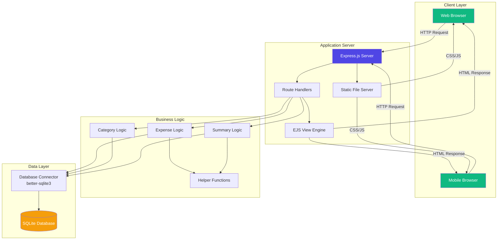

### 1.2 Technology Stack

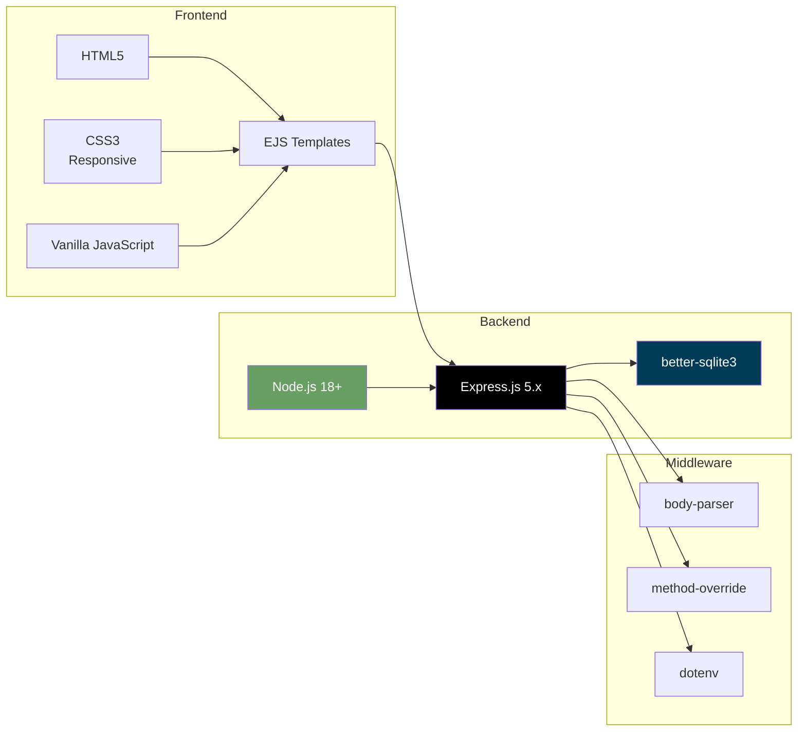

---

## 2. Database Design

### 2.1 Entity Relationship Diagram

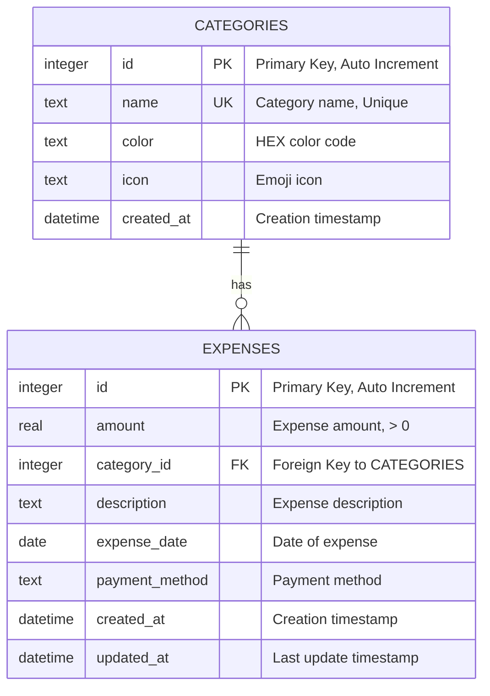

### 2.2 Database Schema Detail

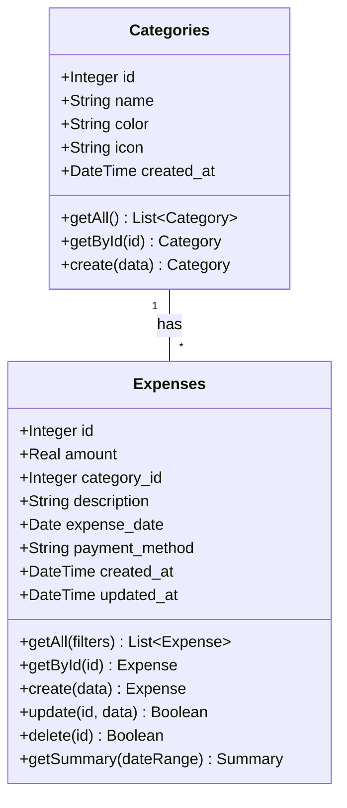

### 2.3 Indexes

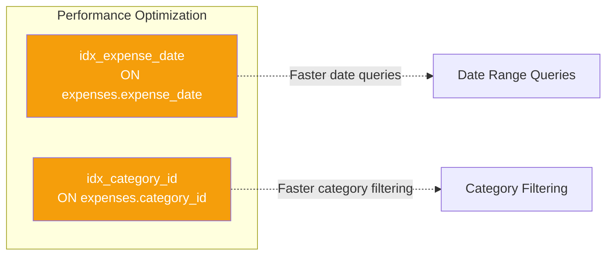

---

## 3. Application Flow

### 3.1 User Journey - Adding Expense

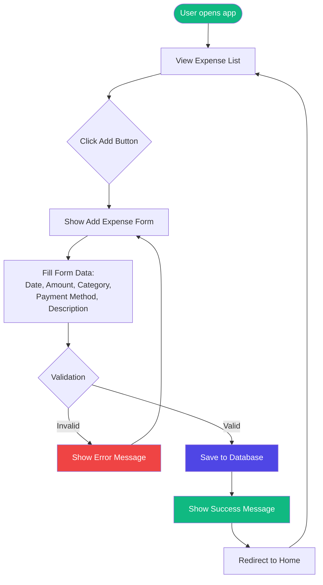

### 3.2 User Journey - Viewing Summary

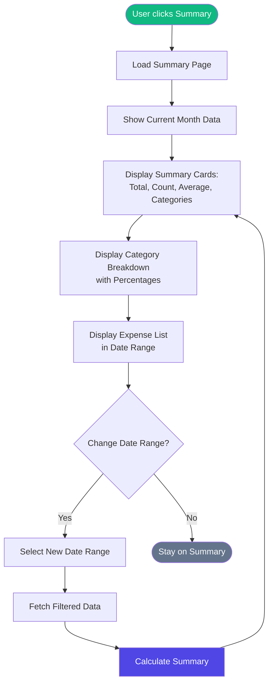

---

## 4. Component Architecture

### 4.1 Server Components

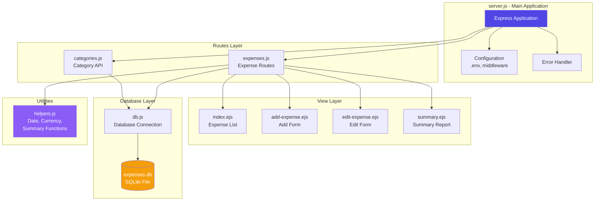

### 4.2 Directory Structure

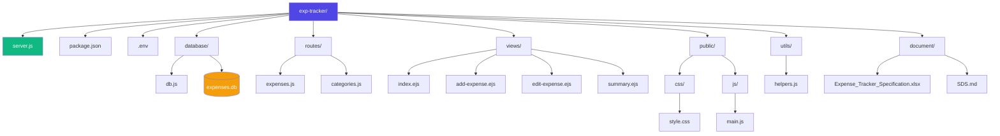

---

## 5. Sequence Diagrams

### 5.1 Create Expense Flow

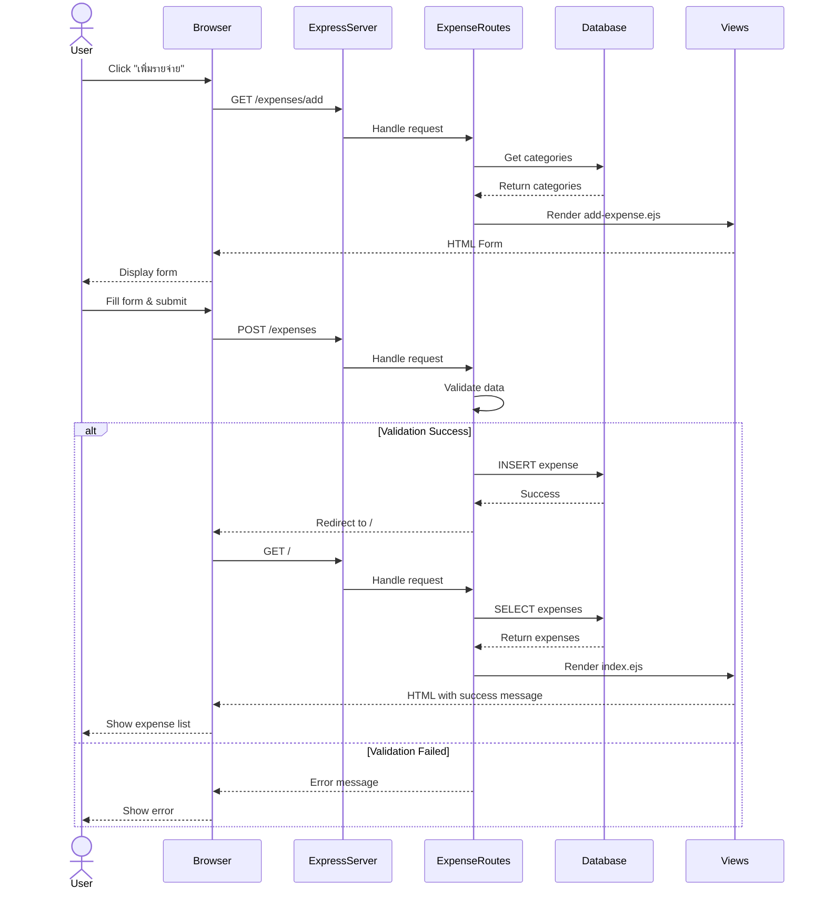

### 5.2 Update Expense Flow

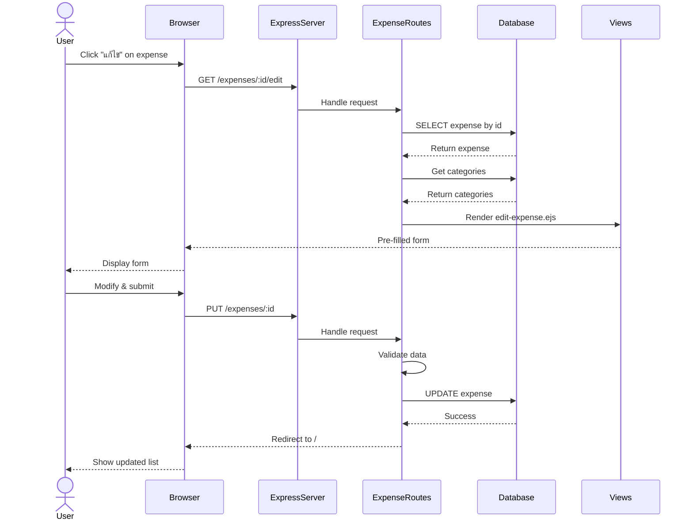

### 5.3 Delete Expense Flow

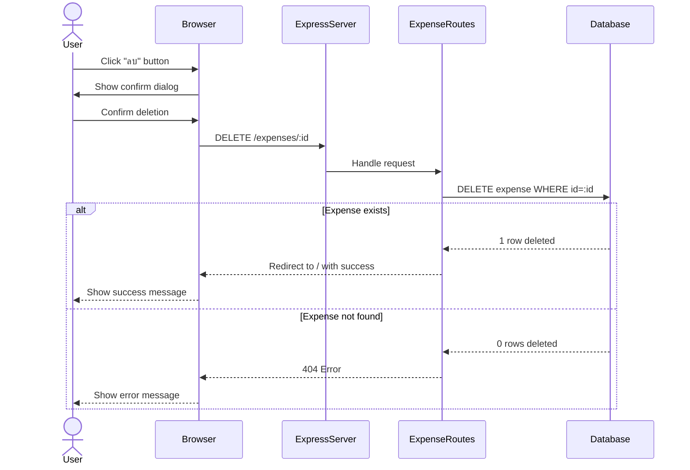

### 5.4 View Summary Flow

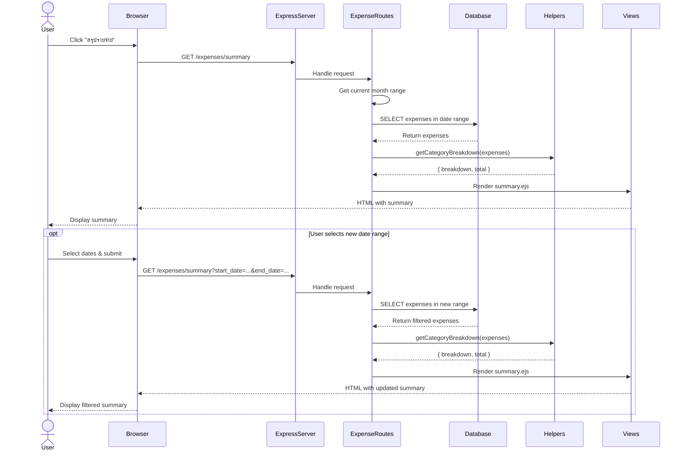

---

## 6. Data Flow Diagrams

### 6.1 Expense Management Data Flow

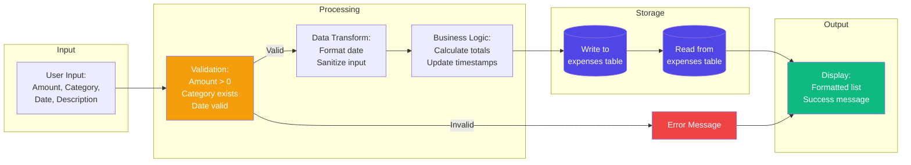

### 6.2 Summary Generation Data Flow

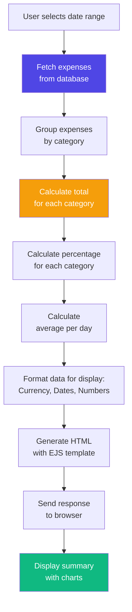

---

## 7. Deployment Architecture

### 7.1 Development Environment

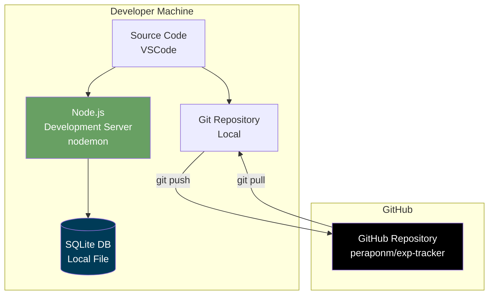

### 7.2 Production Deployment Options

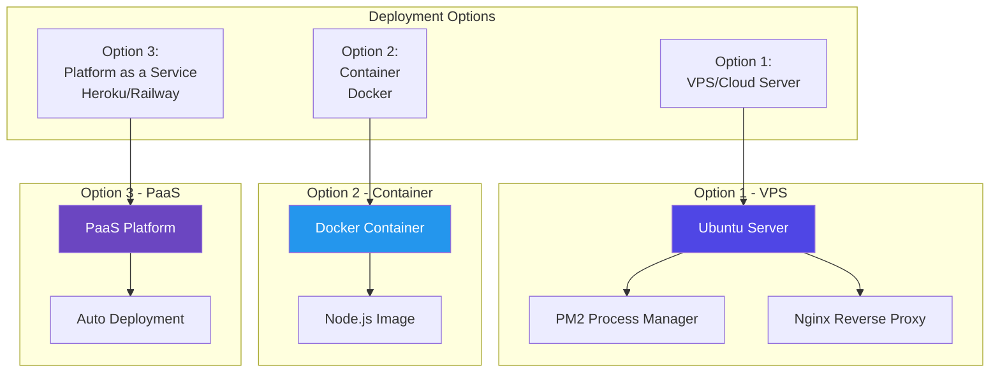

### 7.3 System Requirements

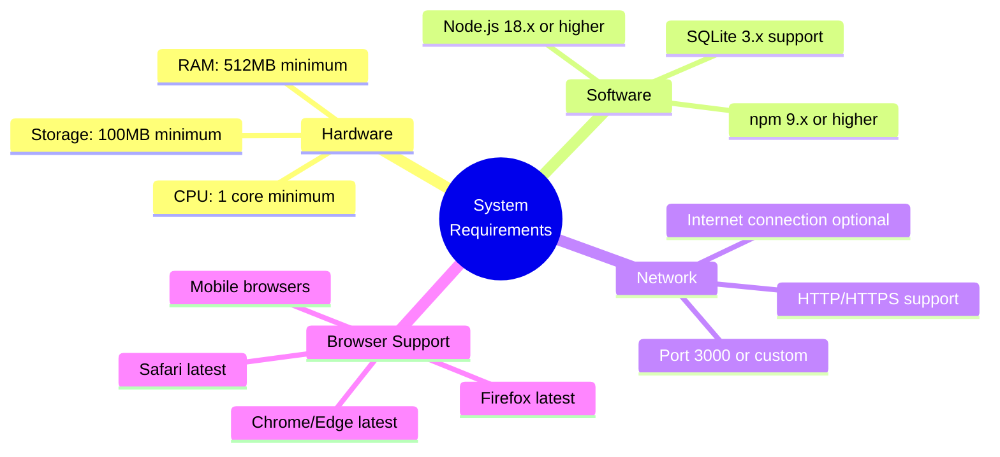

---

## 8. Security Considerations

### 8.1 Current Security Measures

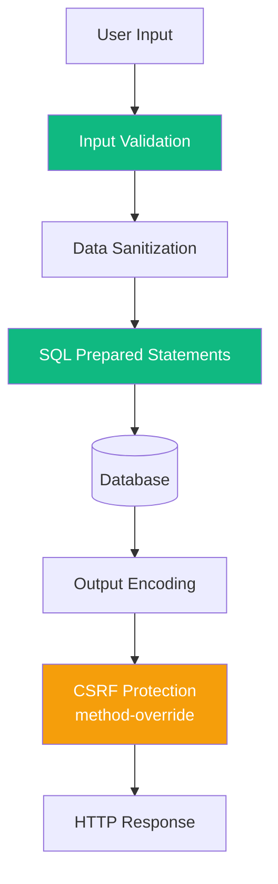

### 8.2 Future Security Enhancements

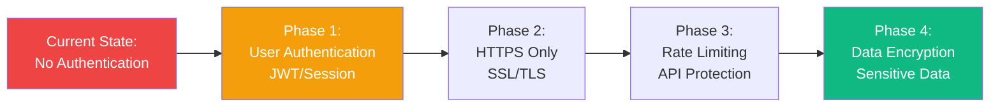

---

## 9. Performance Optimization

### 9.1 Database Query Optimization

```mermaid
graph TD
    Query[SQL Query] --> Index{Index Available?}
    Index -->|Yes| FastQuery[Use Index:<br/>idx_expense_date<br/>idx_category_id]
    Index -->|No| SlowQuery[Full Table Scan]
    FastQuery --> FastResult[Fast Response<br/>&lt; 10ms]
    SlowQuery --> SlowResult[Slower Response<br/>&gt; 100ms]
    
    style FastQuery fill:#10B981,color:#fff
    style SlowQuery fill:#EF4444,color:#fff
    style FastResult fill:#10B981,color:#fff
    style SlowResult fill:#F59E0B,color:#fff
```

### 9.2 Caching Strategy (Future)

```mermaid
graph LR
    Request[HTTP Request] --> Cache{Check Cache}
    Cache -->|Hit| ReturnCached[Return Cached Data]
    Cache -->|Miss| QueryDB[Query Database]
    QueryDB --> StoreCache[Store in Cache]
    StoreCache --> ReturnFresh[Return Fresh Data]
    
    ReturnCached --> Response[HTTP Response]
    ReturnFresh --> Response
    
    style Cache fill:#8B5CF6,color:#fff
    style ReturnCached fill:#10B981,color:#fff
    style QueryDB fill:#F59E0B,color:#fff
```

---

## 10. Error Handling

### 10.1 Error Flow

```mermaid
flowchart TD
    Operation[User Operation] --> TryCatch{Try-Catch Block}
    TryCatch -->|Success| Success[Success Response]
    TryCatch -->|Error| ErrorType{Error Type}
    
    ErrorType -->|Validation Error| ValidationHandler[400 Bad Request<br/>Show error message]
    ErrorType -->|Not Found| NotFoundHandler[404 Not Found<br/>Redirect or show error]
    ErrorType -->|Database Error| DBErrorHandler[500 Server Error<br/>Log error + Generic message]
    ErrorType -->|Unknown Error| GenericHandler[500 Server Error<br/>Log error + Fallback]
    
    Success --> User[User sees result]
    ValidationHandler --> User
    NotFoundHandler --> User
    DBErrorHandler --> User
    GenericHandler --> User
    
    DBErrorHandler --> Logger[Console/File Logger]
    GenericHandler --> Logger
    
    style Success fill:#10B981,color:#fff
    style ValidationHandler fill:#F59E0B,color:#fff
    style NotFoundHandler fill:#F59E0B,color:#fff
    style DBErrorHandler fill:#EF4444,color:#fff
    style GenericHandler fill:#EF4444,color:#fff
```

---

## Appendix

### Technology Decisions

| Decision | Rationale |
|----------|-----------|
| **Node.js + Express** | Simple, fast development, large ecosystem |
| **SQLite** | Zero configuration, file-based, perfect for single-user app |
| **EJS Templates** | Simple syntax, easy to learn, server-side rendering |
| **No Authentication** | MVP focus, single-user local application |
| **Custom CSS** | Full control, no framework overhead, learning opportunity |
| **better-sqlite3** | Synchronous API, better performance than async sqlite3 |

### Future Roadmap

```mermaid
gantt
    title Development Roadmap
    dateFormat YYYY-MM-DD
    section Phase 1 (Complete)
    MVP Development           :done, 2026-02-01, 2026-02-06
    Testing & Deployment      :done, 2026-02-06, 2026-02-06
    
    section Phase 2 (Next)
    User Authentication       :2026-02-15, 30d
    Custom Categories         :2026-02-20, 14d
    Export Features           :2026-03-01, 14d
    
    section Phase 3 (Future)
    Income Tracking          :2026-03-15, 21d
    Charts & Graphs          :2026-04-01, 21d
    Budget Management        :2026-04-20, 21d
    
    section Phase 4 (Long-term)
    Mobile App              :2026-05-15, 90d
    Multi-currency          :2026-06-01, 30d
```

---

**Document Version:** 1.0.0  
**Last Updated:** February 6, 2026  
**Maintained By:** Development Team
